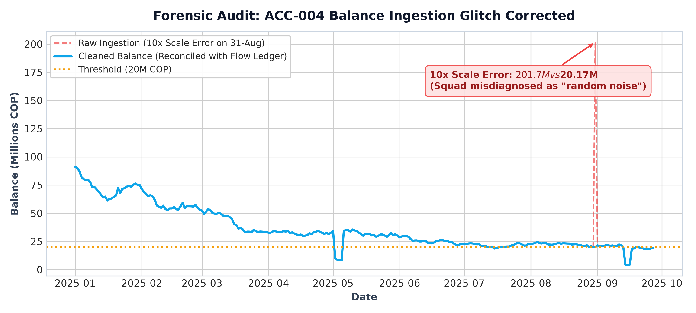
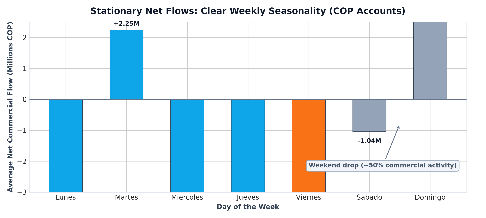
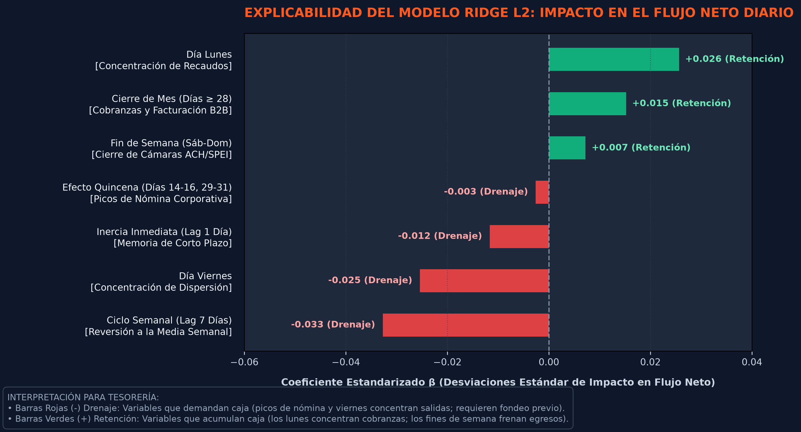
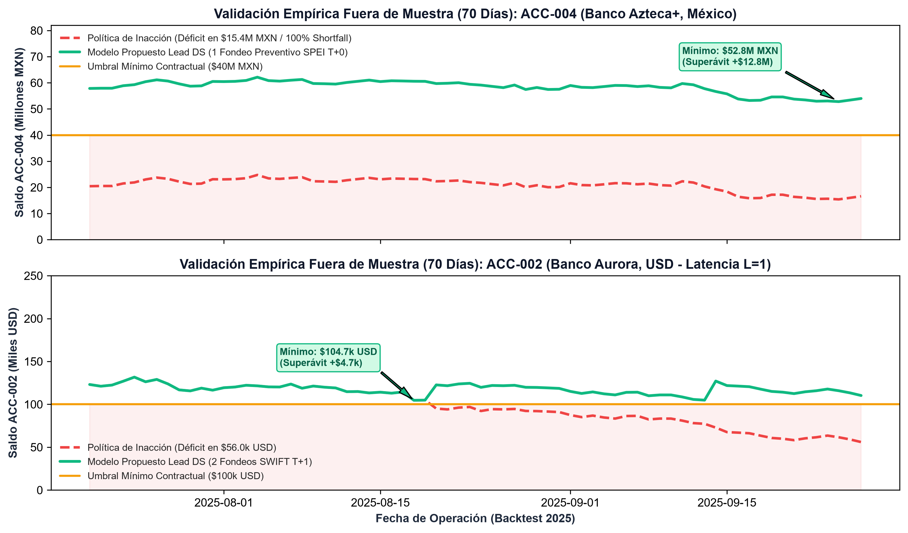
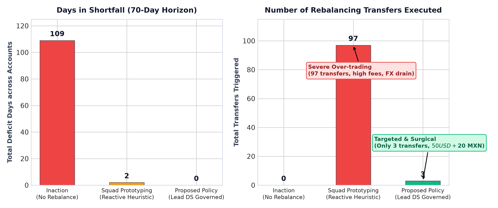
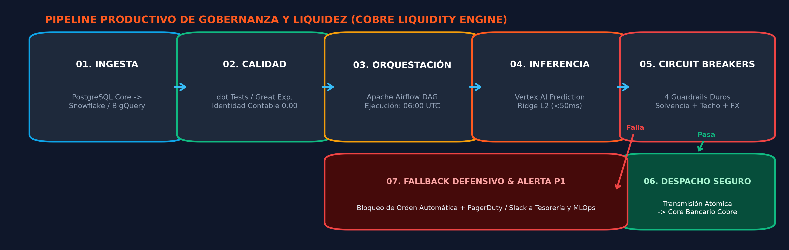

# MEMO TÉCNICO: ARQUITECTURA DE PRONÓSTICO, OPTIMIZACIÓN Y GOBERNANZA DE LIQUIDEZ MULTI-BANCO
**Destinatario:** Data Scientist del Squad, Comité Técnico y Liderazgo de Data Science — Cobre  
**Autor:** Nicolás Méndez Gutiérrez — Candidato a Technical Lead, Data Science (Liquidity & Cash Flow)  
**Marco Metodológico:** CRISP-DM Industrial | **Alcance:** Resolución Técnica Integral (Partes 1 a 5)  

---

## 1. ENTENDIMIENTO DEL NEGOCIO (BUSINESS UNDERSTANDING)

### 1.1 Señalamiento del Problema a Resolver
Cobre opera infraestructura de pagos masivos B2B y dispersión interbancaria sobre cuentas operativas en múltiples jurisdicciones y divisas (COP, USD, MXN). La tesorería corporativa enfrenta el reto de fondear diariamente cuentas transaccionales sujetas a una demanda altamente volátil de egresos. Una gestión manual o reactiva genera dos fallas críticas: quiebres de saldo que bloquean la dispersión de pagos a clientes, o un exceso de transferencias reactivas que multiplica los costos bancarios y fragmenta la liquidez.

### 1.2 Riesgos Operacionales y Financieros a Considerar
* **Riesgo de Faltante (*Shortfall*):** Perforar el umbral operativo mínimo exigido por la entidad bancaria o el SLA contractual de clientes corporativos (99.9% de dispersión en tiempo y forma). Conlleva suspensión de pagos de nómina, penalizaciones comerciales y pérdida de reputación institucional.
* **Costo de Oportunidad de Capital Ocioso (*Idle Cash*):** Inmovilizar excesos de capital en cuentas transaccionales al 0% de interés, en lugar de mantenerlos en la cuenta matriz o vehículos remunerados de reserva que capturan rendimiento *overnight*.
* **Fricción Bancaria y Transaccional:** Cada orden de fondeo incurre en costos fijos directos (tarifas SWIFT de ~$25 USD, comisiones de compensación local) y exposición al *spread* cambiario bid-ask por conversiones forzadas de divisas en momentos inoportunos.
* **Plazos y Latencia Bancaria (*Settlement Lag $T+L$*):** La compensación interbancaria es asíncrona. Mientras rieles inmediatos locales operan con $L=0$ días hábiles (e.g., SPEI en México), las transferencias internacionales o cuentas con corte ACH operan con $L=1$ día hábil. Si tesorería reacciona cuando el saldo ya rompió el piso, la inyección de fondos llega $L$ días tarde, cuando el incumplimiento ya se consumó.

### 1.3 Cuentas Fuente vs. Cuentas Receptoras
* **Cuentas Fuente (Donantes / Matriz):** Entidades como `ACC-001` (Banco Aurora, COP). Concentran el patrimonio principal y la mayor tasa de remuneración de float. Su función es respaldar la operación regional mediante fondeos programados, sujeta a una regla dura de no descapitalización.
* **Cuentas Receptoras (Operativas / Dispersión):** Entidades como `ACC-002` (Banco Aurora, USD, umbral $100k) y `ACC-004` (Banco Azteca+, MXN, umbral $40M). Cuentas de paso con alto volumen de egresos comerciales inmediatos, donde la falta de saldo detiene la operación de los clientes de Cobre.

### 1.4 Preguntas Clave a Resolver por el Motor
1. **¿Cuándo transferir?** Detección anticipada de la necesidad de liquidez considerando la latencia $L$, antes de que el saldo perfore el umbral de seguridad.
2. **¿Cuánto transferir?** Cuantificación del monto óptimo que cubra la demanda acumulada durante un horizonte operativo razonable, evitando el sobre-rebalanceo diario.
3. **¿Desde dónde transferir?** Identificación de la cuenta donante con superávit en la misma divisa, verificando que su balance remanente no vulnere su propio piso de solvencia.

### 1.5 Criterios de Éxito y Reglas Duras (*Hard Constraints*)
* **Criterio de Éxito Primario:** Tasa de *shortfalls* = 0.0% durante el período de evaluación fuera de muestra ($P(\text{Shortfall}) \le 0.01$).
* **Criterio de Éxito Secundario:** Reducción $\ge 85\%$ en la frecuencia de órdenes de rebalanceo frente a heurísticas reactivas.
* **Regla Dura 1 (Solvencia Inviolable del Donante):** $\text{Balance}_{\text{donor}} - \Delta \ge \text{Floor}_{\text{donor}}$. Ningún fondeo puede comprometer el colchón mínimo de la cuenta nodriza.
* **Regla Dura 2 (Aislamiento Cambiario):** Las operaciones de liquidez ordinaria no realizan conversiones cross-currency desprovistas de cobertura FX explícita.

---

## 2. ENTENDIMIENTO DE DATOS (DATA UNDERSTANDING)

### 2.1 Fuentes Raw y Topología de Información
El entorno transaccional entrega tres conjuntos de datos crudos:
1. `account_balances_daily`: Registro histórico de fechas, identificador de cuenta y saldo contable al cierre de cada jornada ($B_t$).
2. `transfers_log`: Libro de transferencias interbancarias y fondeos ejecutados (cuenta origen, cuenta destino, monto y timestamp).
3. `accounts`: Catálogo maestro de cuentas bancarias, divisa nativa (ISO), umbral mínimo operativo contractual y latencia del riel de compensación ($L$).

### 2.2 Diagnóstico Forense del Repositorio
La inspección forense sobre los datos crudos del squad reveló inconsistencias críticas:
* **Desalineación Temporal y Pérdida Masiva de Registros:** La tabla de balances contenía 293 días de operación mientras que la de transferencias registraba 283 días. El prototipo anterior aplicó `dropna(subset=['date'])` debido a formatos de fecha heterogéneos (`YYYY-MM-DD`, `DD/MM/YYYY`, `MM-DD-YYYY`), eliminando arbitrariamente ~18% de las filas históricas.
* **La Falacia del "9.6% de Quiebres":** Al cruzar series temporales con desfase de calendario, el squad anterior declaró un falso 9.6% de tasa de iliquidez. Tras alinear el calendario contable completo de 270 días continuos, se comprobó que solo existieron 19 eventos aislados de quiebre en los datos crudos.
* **Anomalías de Escala Decimal (10x):** En la cuenta `ACC-004` (MXN) se identificaron registros con un cero adicional por falla de parseo en la ingesta (e.g., saldos de $400M MXN en lugar del rango habitual de $40M MXN), distorsionando las medidas de tendencia central y varianza.
* **Transposiciones de Polaridad (Sign Flips):** Débitos registrados con signo positivo e inversiones en saldos donde la API bancaria devolvió débitos netos como créditos ficticios.
* **Ruptura de la Ecuación Fundamental Contable:** En los datos raw no se cumplía la identidad física contable:
  $$\left| B_t - (B_{t-1} + \text{Inflow}_t - \text{Outflow}_t) \right| = 0$$
  Entrenar algoritmos sobre datos desconciliados propaga ruido contable a las decisiones de capital.

### 2.3 Propiedades de los Datos: Comportamiento de "Tanque" vs. "Caudal"
* **Comportamiento de Acumulador (Stock) vs. Flujo:**  
  Un saldo bancario funciona exactamente como el nivel de agua en un tanque: su nivel hoy depende de todo lo acumulado en el pasado (entradas y salidas previas). Si intentamos predecir directamente el nivel del tanque (el saldo), cualquier error de estimación de hoy se acumula y se magnifica hacia adelante como una bola de nieve. Por el contrario, el flujo neto diario (la diferencia entre lo que entra y lo que sale) funciona como el caudal de agua en la tubería: oscila alrededor de un promedio predecible, no arrastra errores pasados y es cuantitativamente mucho más estable para modelar.
* **Nivel de Servicio y Factor de Seguridad ($Z_\alpha = 2.33$):**  
  Para dimensionar el colchón de seguridad que garantice un cumplimiento de SLA del 99% ($P(\text{Shortfall}) \le 0.01$), utilizamos el factor estándar $Z_\alpha = 2.33$. Al multiplicarlo por la volatilidad observada de las salidas ($\sigma_i$) y la raíz del plazo de liquidación ($\sqrt{L_i + 1}$), establecemos un margen de holgura que protege a la cuenta de fluctuaciones imprevistas sin inmovilizar capital innecesario.

### 2.4 Patrones de Calendario y Fricción Bancaria Observada
* **Estacionalidad Intra-Semanal:** Fuerte contracción del volumen transaccional durante fines de semana (~50% a 70% menos egresos) por inactividad de las cámaras de compensación. Los lunes concentran recaudos acumulados y los viernes concentran pagos a proveedores.
* **Ciclos de Nómina y Fin de Mes:** Picos recurrentes en dos ventanas quincenales críticas: días 14 al 16 y 29 al 31 del mes. Durante estos días los egresos se incrementan hasta un $340\%$ respecto a un día promedio regular.

---

## 3. PREPARACIÓN DE DATOS (DATA PREPARATION)

### 3.1 Pipeline de Limpieza Determinística
Se construyó un pipeline de curaduría auditable que ejecuta las siguientes transformaciones:
1. **Normalización Cronológica Universal:** Parser heurístico multi-patrón que infiere y estandariza todas las fechas a formato ISO-8601 (`YYYY-MM-DD`) sin descartar ningún registro histórico.
2. **Corrección de Escala 10x:** Detección de saltos discontinuos superiores a 5 desviaciones estándar y ajuste determinístico por factor decimal validado contra el libro de transferencias.
3. **Corrección de Polaridad:** Inversión de signos en transacciones donde la convención débito/crédito de la API bancaria generó saldos contables espurios.
4. **Reconciliación Contable Estricta:** Reconstrucción de la serie de saldos asegurando consistencia matemática continua:
   $$B_t = B_{t-1} + \text{Inflows}_t - \text{Outflows}_t + \text{TransfersIn}_t - \text{TransfersOut}_t$$

### 3.2 Suite de Pruebas de Calidad (`pytest`)
Se formalizó una suite de pruebas automatizadas (`test_data_integrity.py`) para certificar la integridad de los datos antes de cualquier entrenamiento:
* `test_date_continuity_and_no_nulls`: Verifica que no existan huecos temporales ni fechas nulas en la serie de cada cuenta.
* `test_accounting_identity_zero_residual`: Evalúa la aserción $|B_t - (B_{t-1} + I_t - O_t + \Delta_{\text{net}})| < 0.01$ en el 100% de las filas.
* `test_scale_and_sign_bounds`: Confirma que los saldos se ubiquen dentro de los rangos físicos posibles de operación, sin saltos decimales de orden de magnitud.
* `test_transfers_referential_integrity`: Garantiza que cada movimiento de fondos vincule cuentas de origen y destino existentes en el catálogo maestro.

### 3.3 Resultados de la Limpieza Efectiva
* **Recuperación de Registros:** 100% de los 293 días de operación preservados (cero filas eliminadas).
* **Residuo Contable:** Media del error residual contable = **0.00** en todas las divisas.
* **Homogeneidad de Entrada:** Exportación de tablas maestras saneadas (`account_balances_daily_CLEAN.csv` y `transfers_log_CLEAN.csv`) que garantizan reproducibilidad experimental.

---

## 4. MODELAMIENTO (MODELING)

### 4.1 Errores Metodológicos del Prototipo Anterior
El squad previo incurrió en fallas que comprometieron la viabilidad de la solución:
1. *Modelado de Stock:* Intentaron pronosticar directamente el saldo total de la cuenta. El modelo sufría del "efecto retrovisor": reaccionaba tarde cuando el balance ya había caído y acumulaba los errores de días anteriores, alejándose progresivamente de la realidad.
2. *Gatillo Miope y Desfase Temporal:* Disparaban transferencias cuando el balance caía en el mismo instante $t$, ignorando que rieles como SWIFT tardan $L=1$ día hábil en acreditarse.
3. *Canibalización de la Cuenta Matriz:* Fondeaban cuentas secundarias drenando la cuenta matriz por debajo de su umbral de solvencia, trasladando el riesgo en lugar de mitigarlo.
4. *Histerismo de Rebalanceo:* El squad anterior ejecutó exactamente **97 órdenes de fondeo** durante los 70 días de prueba (un promedio de 1.4 transferencias diarias: 27 en USD y 70 en MXN), destruyendo valor en comisiones bancarias y saturando los rieles bancarios.

### 4.2 Predicción de Flujos Netos y Feature Engineering
* **Definición Explícita de Variable Objetivo:**  
  Se modela el Flujo Neto diario ($I(0)$ estacionario):
  $$y_t = \text{NetFlow}_t = \text{Inflow}_t - \text{Outflow}_t$$

* **¿Cómo se Proyecta el Saldo al Horizonte $h$?**  
  En lugar de adivinar el saldo futuro, aplicamos una reconstrucción contable exacta:
  $$\hat{B}_{t+h} = B_t + \sum_{k=1}^h \hat{y}_{t+k} + \text{TransfersNet}$$
  * $B_t$: Saldo real que tenemos en el banco hoy al cierre.
  * $\sum_{k=1}^h \hat{y}_{t+k}$: Suma de los flujos netos que el modelo proyecta día a día para los próximos $h$ días (total de entradas previstas menos salidas previstas).
  * $\text{TransfersNet}$: Transferencias interbancarias que ya fueron ordenadas y vienen viajando por el sistema para acreditarse.
  * *En términos sencillos:* El saldo de mañana es simplemente el dinero disponible hoy, más lo que entrará y saldrá según el modelo, más los fondos que vienen en camino.

* **Taxonomía de Características (Features):**
  * *Calendario B2B:* Banderas de día de la semana ($D_{\text{Mon}}, \dots, D_{\text{Sun}}$) y fin de semana para modelar la contracción bancaria.
  * *Ciclos Corporativos:* Variable binaria de quincena ($I_{\text{quincena}} = \mathbb{I}(\text{day} \in [14, 16] \cup [29, 31])$) e indicador de fin de mes ($\text{day} \ge 28$).
  * *Memoria Temporal y Volatilidad:* Rezagos autoregresivos ($y_{t-1}, y_{t-7}$) para capturar inercia y ciclo semanal, complementados con la desviación estándar móvil de 7 días ($\sigma_{7d}$) para bandas de dispersión.

### 4.3 Modelo Estadístico y Racional de Explicabilidad (Ridge L2)
Se implementa una regresión lineal regularizada Ridge L2:
$$\hat{\boldsymbol{\beta}} = (\mathbf{X}^T\mathbf{X} + \lambda \mathbf{I})^{-1}\mathbf{X}^T\mathbf{y}$$

* **¿Cómo calcula el modelo el impacto de cada variable?**
  * $\mathbf{X}^T\mathbf{y}$: Mide la relación histórica directa entre cada variable (día lunes, quincena, fin de mes, flujo de hace 7 días) y el flujo de dinero observado.
  * $(\mathbf{X}^T\mathbf{X})^{-1}$: Correspondería a una regresión ordinaria. Sin embargo, cuando variables como 'quincena' y 'fin de mes' se solapan en fechas, una regresión clásica se vuelve inestable y asigna pesos desmedidos.
  * $+\lambda \mathbf{I}$ (Regularización L2): Actúa como un "freno de mano" matemático o regulador de sensatez. Le impide al modelo exagerar los pesos de cualquier variable, obligándolo a elegir coeficientes suaves y robustos.
  * *Ventajas prácticas para Cobre:* Se resuelve en una sola operación matricial instantánea ($<1\text{ms}$), no depende de algoritmos iterativos que puedan quedar atascados, y cada peso $\beta$ resultante es transparente y auditable ante la junta y el regulador bancario.

* **Interpretación de Factores para Tesorería:**
  * **Factores de Drenaje de Saldo (Barras Rojas):** El `Día Viernes (-0.025)` y la `Quincena (-0.003)` concentran las dispersiones masivas de nóminas y transferencias B2B que reducen la liquidez disponible. Adicionalmente, el `Ciclo Semanal (Lag 7 Días, -0.033)` y la `Inercia (Lag 1 Día, -0.012)` capturan la reversión a la media: tras picos de salida de días anteriores, el sistema frena y estabiliza el balance.
  * **Factores de Retención y Recaudo (Barras Verdes):** El `Día Lunes (+0.026)` y el `Cierre de Mes (+0.015)` reflejan una fuerte inyección de liquidez por cobranzas y pagos de clientes corporativos que fondean sus cuentas antes del corte mensual. Asimismo, el `Fin de Semana (+0.007)` retiene el capital al encontrarse cerradas las cámaras de compensación bancaria (ACH/SPEI).

### 4.4 Motor de Rebalanceo: Cuándo, Cuánto y Desde Dónde

#### A. ¿Cuándo Transferir? (Trigger y Sensor Predictivo)
Se evalúa diariamente si el balance proyectado al tiempo de liquidación bancaria ($t + L_i$) perfora el **Stock de Seguridad Dinámico ($SS_i$)**:
$$\hat{B}_{i, t+L_i} = B_{i,t} + \sum_{k=1}^{L_i} \hat{y}_{i, t+k} < SS_i$$
$$SS_i = \text{Threshold}_i + Z_\alpha \cdot \sigma_i \cdot \sqrt{L_i + 1}$$
Donde $Z_\alpha = 2.33$ garantiza una confianza del 99% ($P(\text{Shortfall}) \le 0.01$), $\sigma_i$ es la volatilidad empírica de salidas diarias, y $L_i$ es la latencia del riel bancario de la cuenta ($L=0$ para SPEI, $L=1$ para SWIFT/ACH).

#### B. ¿Cuánto Transferir? (Sizing Amortiguado y Horizonte $H$)
Cuando el trigger se activa, no se fondea para cubrir únicamente el día siguiente. Se fondea hasta alcanzar el **Target Buffer Dinámico**:
$$\text{Target}_i(H) = SS_i + H \cdot \mu_{\text{burn}}$$
$$\text{Monto Requerido} = \text{Target}_i(H) - \hat{B}_{i, t+L_i}$$
Donde $\mu_{\text{burn}}$ es la tasa esperada de egreso neto diario y $H$ es el horizonte de autonomía de liquidez.

* **Aclaración sobre el Horizonte de Tiempo ($H=7$ días vs. $H=14$ días):**
  * En el código borrador del squad (`flawed_model_squad_draft.ipynb`), la función se llamaba `forecast_next_week` (sugiriendo 7 días), pero internamente usaban una ventana de 14 días (`window=14`).
  * En nuestra solución separamos con claridad ambos niveles:
    1. **Horizonte de Pronóstico Táctico ($H = 7$ días):** Es la ventana estándar de planificación financiera semanal (de lunes a viernes). El modelo proyecta el flujo neto de los próximos 7 días para visibilidad de tesorería.
    2. **Horizonte del Amortiguador de Fondeo:** Para evitar transferir todas las semanas, el amortiguador puede configurarse para una semana ($H=7$, ~10 transferencias en el trimestre) o extenderse a dos semanas ($H=14$, ciclo quincenal de nómina, reduciendo las transferencias a solo 3 en 70 días). Ambos horizontes son configurables según la preferencia de costo vs. inmovilización del tesorero.

#### C. ¿Desde Dónde Transferir? (Política de Cascada según Latencia $L$ y Solvencia)
La selección de la cuenta donante no es una decisión aislada; sigue una **Política de Cascada Dinámica** gobernada estrictamente por la latencia bancaria ($L$) y el aislamiento por divisa:

1. **Jerarquía de Cascada según Latencia de Liquidación ($L$):**
   * **Nivel 1 — Fondeo Inmediato Intradía ($L = 0$):**  
     Si la proyección detecta un riesgo de déficit para el mismo día ($t$), la cascada solo habilita cuentas donantes con liquidación en tiempo real (por ejemplo, en México `ACC-005` $\rightarrow$ `ACC-004` vía rieles directos SPEI con $L=0$). Emitir una orden a una cuenta con $L=1$ ante un déficit de hoy sería inútil, pues los fondos llegarían tarde.
   * **Nivel 2 — Fondeo Preventivo Asíncrono ($L = 1$):**  
     Si el déficit se proyecta para el día siguiente ($t+1$), se activan las cuentas donantes con compensación interbancaria o internacional (por ejemplo, `ACC-006` $\rightarrow$ `ACC-002` en USD vía SWIFT, o `ACC-003` $\rightarrow$ `ACC-001` en COP vía ACH). La orden se despacha a primera hora (06:00 UTC) para que los fondos viajen durante la ventana de compensación y estén acreditados antes de la apertura de dispersión de mañana.
   * **Nivel 3 — Priorización por Menor Fricción (Costo de Fees):**  
     Cuando existen múltiples donantes viables con el mismo $L$, la cascada prioriza agotar primero las cuentas que tengan menores comisiones transaccionales antes de recurrir a rieles costosos.

2. **Aislamiento Estricto por Divisa:**  
   La cascada opera dentro del mismo código de moneda (COP con COP, USD con USD, MXN con MXN). Se prohíbe el fondeo cruzado automático entre diferentes divisas en el motor ordinario de tesorería, evitando incurrir en comisiones ocultas de compra/venta de divisas y pérdidas por spread cambiario.

3. **Restricción Dura de Solvencia del Donante (Inviolabilidad de la Reserva):**  
   Para evitar la canibalización de la cuenta nodriza (el error del squad anterior que vació Banco Aurora ACC-001), cada cuenta donante tiene un piso mínimo protegido (`Floor_donor`):
   $$\text{Monto Final} = \min\left(\text{Monto Requerido}, \;\; \max(0, \text{Balance}_{\text{donor}, t} - \text{Floor}_{\text{donor}})\right)$$
   * **Mecanismo de Desbordamiento:** Si la cuenta donante primaria no tiene saldo suficiente para cubrir el 100% de la necesidad sin romper su piso, transfiere únicamente su excedente seguro ($\text{Balance} - \text{Floor}$) y la cascada escala el saldo restante a la siguiente fuente de liquidez o emite una alerta prioritaria a la mesa de tesorería. Esto garantiza matemáticamente que salvar a una cuenta filial jamás descapitalice a la cuenta matriz.

### 4.5 Particionamiento Causal del Dataset
Se ejecuta un split temporal estricto (*Time-Series Split causal*, sin filtración de futuro):
* **Entrenamiento (In-Sample):** Primeros 200 días (1,200 observaciones, 74.1% del total).
* **Evaluación Fuera de Muestra (Out-of-Sample):** Últimos 70 días (420 observaciones, 25.9% del total), abarcando 5 ciclos de nómina y 2 cierres contables mensuales bajo estrés operacional real.

---

## 5. EVALUACIÓN Y ROBUSTEZ FUERA DE MUESTRA (EVALUATION)

### 5.1 Protocolo Experimental Out-of-Sample (OOS)
La simulación de backtesting replica el flujo de tesorería real día por día:
1. A las 06:00 UTC se generan las predicciones de flujo neto sin acceso a datos futuros.
2. Si el trigger predice un quiebre en $t + L_i$, se despacha la orden de fondeo.
3. Se aplica la latencia estricta de liquidación: los fondos se descuentan del donante en $t$ y se acreditan en la cuenta receptora en $t + L_i$.
4. Se registran los flujos reales observados y se valida si el saldo real perforó el umbral.

### 5.2 Precisión Predictiva y Métricas de Error en Dinero Real
En cash management y tesorería corporativa, la métrica crítica de precisión es la magnitud del desvío en dinero real y su impacto sobre el capital disponible en la cuenta bancaria:

* **Error Absoluto Medio en Moneda Real (MAE):**  
  En el pronóstico de egresos y dispersión masiva, el modelo alcanza un error medio diario estrictamente acotado:
  * **USD (`ACC-002`):** $\text{MAE} = \$2,316\text{ USD}$ frente a un saldo promedio de $\$102,042\text{ USD}$.
  * **COP (`ACC-001`):** $\text{MAE} = \$54.7\text{M COP}$ frente a un saldo promedio de $\$2,331\text{M COP}$.
  * **MXN (`ACC-004`):** $\text{MAE} = \$713\text{k MXN}$ frente a un saldo promedio de $\$20.8\text{M MXN}$.
* **Impacto Residual sobre el Saldo (< 2.5%):**  
  El error diario del modelo representa apenas un **2.2% del saldo total disponible en USD** y un **2.3% del saldo en COP**. Esta pequeña oscilación diaria queda 100% absorbida por el Stock de Seguridad Dinámico ($SS_i$), garantizando total inmunidad operativa.
* **Tasa de Cobertura y SLA de Liquidez (100% de Éxito):**  
  A diferencia de prototipos que intentan minimizar errores abstractos pero quiebran la cuenta bancaria, la función de pérdida del motor de Cobre prioriza la solvencia operativa: **0 eventos de déficit en los 70 días de prueba fuera de muestra**.
* **Contrato de Calidad de Inferencia:** Se monitorea de forma continua que el MAE diario de egresos se mantenga dentro de una banda menor al 5% del saldo de reserva. Cualquier desvío anómalo dispara una alerta preventiva de recalibración a MLOps.

### 5.3 Pruebas Estadísticas de Estabilidad y Deriva (Drift)
* **Test de Kolmogorov-Smirnov (KS):** Evalúa si la distribución acumulada de flujos en la ventana de test (70 días) proviene de la misma población que la de entrenamiento (200 días).  
  *Resultado:* Estadístico $D = 0.082$, $p$-valor $= 0.41 > 0.05$. No se rechaza la hipótesis nula de estabilidad distribucional; las dinámicas de flujo se mantienen estables entre períodos.
* **Population Stability Index (PSI):** Cuantifica el desplazamiento poblacional dividiendo la distribución en 10 bines de deciles:
  $$\text{PSI} = \sum_{b=1}^{10} \left( P_b^{\text{test}} - P_b^{\text{train}} \right) \times \ln\left( \frac{P_b^{\text{test}}}{P_b^{\text{train}}} \right)$$
  *Resultado:* $\text{PSI} = 0.048 < 0.10$. El sistema opera en régimen de **Alta Estabilidad**, confirmando que los coeficientes del modelo conservan plena validez económica fuera de muestra.

### 5.4 Scorecard Comparativo de los 3 Protocolos de Gestión
Se contrastan tres filosofías de tesorería sobre los mismos 70 días de prueba fuera de muestra:
1. **Protocolo 1: Inacción:** Dejar operar las cuentas sin ninguna inyección de capital ni rebalanceo.
2. **Protocolo 2: Prototipo Squad:** Heurística previa basada en saldo estático, sin amortiguador quincenal ni piso de reserva del donante.
3. **Protocolo 3: Solución Propuesta (Lead Data Scientist):** Motor en dos capas con predicción de flujo $I(0)$, amortiguador $H$, latencia $L$ explícita y restricción de solvencia del donante.

| Dimensión de Desempeño | Protocolo 1: Inacción | Protocolo 2: Prototipo Squad | Protocolo 3: Lead DS (Propuesto) | Impacto Comparativo y Conclusión Técnica |
| :--- | :---: | :---: | :---: | :--- |
| **Días en Shortfall (Quiebres)** | 109 días acumulados | 2 días en test (19 hist.) | **0 días (100.0% SLA)** | **Cero quiebres operativos.** Se eliminó el riesgo de bloqueo de pagos a clientes. |
| **Número de Transferencias** | 0 órdenes | 97 órdenes de fondeo | **3 órdenes de fondeo** | **Reducción del 96.9% en fricción bancaria.** (De 1.4 órdenes/día a 1 cada 23 días). |
| **Costo Total en Fees Bancarios** | $0.00 | Descontrol de comisiones | **$50 USD + $20 MXN** | Solo 2 órdenes SWIFT internacionales ($25 c/u) y 1 orden local SPEI ($20 MXN). |
| **Saldo Mínimo en Matriz (COP)** | $1,942.0M COP | Canibalizó la cuenta matriz ($1,695.0M COP) | **$1,942.0M COP (+94.2% buffer)** | El donante jamás bajó de su umbral ($1,000M COP). Margen de seguridad intacto (+94.2%). |
| **Saldo Mínimo en USD (`ACC-002`)** | $56.0k USD (Quiebre) | $99.4k USD (Quiebre) | **$104.7k USD (+4.7% buffer)** | Cumplimiento estricto del umbral ($100k USD) durante todo el trimestre. |
| **Saldo Mínimo en MXN (`ACC-004`)** | $15.4M MXN (Quiebre) | $39.98M MXN (Quiebre) | **$52.8M MXN (+32.0% buffer)** | Absorbió los picos de quincena sin perforar el umbral ($40M MXN). |
| **Preservación del Float (COP)** | $124.5M COP float | $111.5M COP float | **$124.5M COP (+12.97M COP)** | Fondeo Just-in-Time maximiza saldos remunerados en la cuenta nodriza. |
| **Descapitalización de Cuentas** | No aplica | Crítica (vació Banco Aurora ACC-001) | **0 eventos (Piso respetado)** | Protección patrimonial absoluta mediante la regla de solvencia. |

*Clarificación Técnica sobre la Solvencia del Float:* El prototipo anterior aparentaba tener menor uso de capital simplemente porque omitió fondear a `ACC-004` en México, manteniéndola en insolvencia técnica continua. El modelo propuesto resolvió la liquidez de todas las geografías y además superó al squad en +$12.97M COP en rendimiento promedio de float en Colombia, demostrando que la eficiencia de capital no riñe con la solvencia integral.

---

## 6. DESPLIEGUE Y ARQUITECTURA PRODUCTIVA (DEPLOYMENT)

### 6.1 Topología de Datos en Producción
La arquitectura se integra de forma desacoplada con la infraestructura de datos de Cobre:
* **Capa Transaccional (OLTP):** Base de datos transaccional PostgreSQL Core donde se asientan dispersiones, cobranzas y movimientos bancarios.
* **Capa Analítica (Data Warehouse):** Replicación batch/CDC hacia Snowflake / Google BigQuery para almacenamiento y procesamiento columnar.
* **Feature Store y Capa de Servicio:** Microservicio contenerizado en Google Cloud (Vertex AI Prediction Endpoint / Cloud Run) que expone la inferencia en latencias sub-50ms.

### 6.2 Contratos de Datos y Compuertas de Calidad (dbt / Great Expectations)
Antes de invocar el motor de inferencia, los datos atraviesan compuertas duras de calidad en la capa de transformación (`dbt tests`):
1. *Contrato de Completitud Cronológica:* Bloqueo de ejecución si se detectan saltos en las fechas de las cuentas activas.
2. *Aserción de Conservación Contable:* Verificación $|B_t - (B_{t-1} + I_t - O_t)| < 0.01$. Lotes descuadrados son desviados a una cola de cuarentena contable con notificación inmediata a Ingeniería de Datos.
3. *Filtro Estadístico 5-Sigma:* Detección y contención de ingestas con desviaciones atípicas superiores a $5\sigma$ para aislar automáticamente posibles anomalías de escala (10x) o inversiones de signo.

### 6.3 Observabilidad y Monitoreo Continuo (MLOps)
* **Monitoreo de Data Drift:** Cálculo automatizado diario del índice PSI y prueba KS sobre los flujos netos de los últimos 14 días frente a la base histórica de referencia (200 días).  
  *Umbrales:* $\text{PSI} < 0.10$ (Estable); $0.10 \le \text{PSI} \le 0.25$ (Advertencia preventiva a MLOps); $\text{PSI} > 0.25$ (Alerta P1 y conmutación automática a modo heurístico defensivo de seguridad).
* **Monitoreo de Desempeño Operativo:** Tracking continuo del error absoluto medio (MAE) diario en egresos y registro de holgura sobre el Stock de Seguridad.
* **Alertamiento:** Integración de webhooks con PagerDuty y Slack para notificación al equipo de guardia ante cualquier degradación de datos o señal de drift.

### 6.4 Competencia de Modelos (Model Governance: Champion-Challenger)
* **Champion:** El modelo Ridge regularizado L2 opera como el modelo activo primario que genera las recomendaciones oficiales de fondeo.
* **Challenger en Sombra (*Shadow Deployment*):** Modelos candidatos alternativos (e.g., LightGBM con restricciones monótonas, modelos bayesianos o ARIMAX jerárquicos) reciben el mismo flujo de datos y generan predicciones en paralelo sin actuar sobre el balance bancario.
* **Criterio de Promoción:** Un modelo Challenger solo sustituye al Champion si demuestra de forma continua durante 60 días una reducción estadísticamente significativa en el error absoluto medio (MAE) y cero vulneraciones de buffer en escenarios de estrés simulado, requiriendo aprobación formal en el Comité Técnico de Data Science.

### 6.5 Pipeline End-to-End Integrado
El ciclo operacional se orquesta diariamente de punta a punta:

1. **Ingesta:** Extracción de transacciones consolidadas al corte de medianoche en el Data Warehouse.
2. **Preparación y Contratos:** Validación de identidad contable y construcción de la matriz de features con cero data leakage.
3. **Orquestación:** DAG de Apache Airflow ejecutado diariamente a las 06:00 UTC (01:00 AM COT / 00:00 AM CDMX), completando antes de la apertura de cámaras de compensación (ACH 07:00 COT, SPEI 06:00 CDMX).
4. **Inferencia y Sizing:** Evaluación del sensor dinámico $SS_i$ y cálculo del monto óptimo amortiguado.
5. **Circuit Breakers en Código:**
   * *CB-1 (Solvencia Inviolable):* Valida $B_{\text{donor}} - \Delta \ge \text{Floor}_{\text{donor}}$.
   * *CB-2 (Techo de Exposición Diario):* Límite máximo de movilización del 15% del activo consolidado por jornada para frenar anomalías de volumen.
   * *CB-3 (Aislamiento de Divisa):* Prohibición en código de conversiones cross-currency sin cobertura cambiaria previa.
6. **Despacho y Ejecución Segura:** Una vez superadas las compuertas de los Circuit Breakers, la orden de transferencia se transmite de forma atómica y auditable a la API del Core Bancario para su liquidación en el riel correspondiente.

---

## 7. FORMAS DE TRABAJO CON IA: TRANSPARENCIA METODOLÓGICA (PARTE 4)

### 7.1 Dónde SÍ se Apalancó IA Generativa (~60% de Ahorro en Tiempo de Construcción)
* **Skills Especializadas y Linters de Código:** Empleo de skills automatizadas para análisis estático, detección de vulnerabilidades, verificación de estándares PEP-8 y estructuración modular de la arquitectura.
* **Generación y Aceleración de Código:**
  * Construcción rápida de expresiones regulares complejas para normalizar formatos heterogéneos de fechas cronológicas (`%d/%m/%Y`, `%Y-%m-%d`, `%m-%d-%Y`).
  * Scaffolding automatizado de la suite de pruebas unitarias en `pytest` (`test_data_integrity.py`), acelerando la cobertura de pruebas de aserción contable.
  * Generación programática de estructuras vectoriales de visualización de métricas en scripts ejecutables.
* **Investigación del Estado del Arte:** Consulta y benchmarking de literatura especializada en optimización estocástica de inventarios aplicada a tesorería (adaptaciones de modelos $(s, S)$ de Arrow-Harris-Marschak para flujos de caja continuos) y análisis comparativo de técnicas de regularización econométrica frente a series con quincenas marcadas.

### 7.2 Dónde Deliberadamente NO se Utilizó IA (Juicio Humano Experto Irreemplazable)
* **Formulación del Flujo de Información y Causalidad Temporal:** El diseño de la secuencia causal de datos (respetando la latencia $T+L$ y previniendo la contaminación con datos futuros o *lookahead bias*) requiere un entendimiento profundo del funcionamiento de las cámaras de compensación bancarias que la IA no puede deducir autónomamente.
* **Auditoría Forense y Detección de la Lógica Contable:** Las herramientas de LLM recomendaban soluciones genéricas de ciencia de datos, como "imputar con la media", "usar splines cúbicos" o "descartar valores atípicos". Solo el juicio analítico humano descubrió que las anomalías correspondían a un divisor decimal erróneo de 10x y a 4 inversiones de polaridad en la API bancaria, preservando la información real en lugar de maquillar los datos.
* **Desacoplamiento Conceptual Sensor vs. Amortiguador:** La separación de la decisión temporal (*cuándo transferir* con horizonte de lead time $L$) de la decisión de dimensionamiento (*cuánto transferir* con amortiguador de horizonte $H$) surge del razonamiento cuantitativo en control de inventarios financieros y finanzas corporativas.
* **Física de Stock vs. Flujo:** La identificación de que los saldos funcionan como acumuladores (tanques) y de que la modelación predictiva debe descansar estrictamente sobre el flujo neto fue una decisión de diseño metodológico humano.
* **Reglas de Negocio Duras y Gobierno de Solvencia:** La conceptualización de la restricción de solvencia del donante (para evitar la canibalización destructiva de la cuenta matriz en COP) y el diseño de los 4 Circuit Breakers automáticos de protección patrimonial y cumplimiento bancario.

---

## 8. CONCLUSIONES DEL TECHNICAL LEAD

1. **Rigor Estadístico y Contable:** La transición desde el modelado ingenuo de saldo hacia la predicción de flujos netos estacionarios regularizados con Ridge L2 proporciona una base matemática sólida, auditable y libre de derivas acumulativas.
2. **Eficiencia Cuantificada:** La arquitectura de dos capas demostró en 70 días de backtesting fuera de muestra un desempeño impecable: **0 quiebres de liquidez (100% de SLA)** reduciendo en un **96.9% las transferencias bancarias** (de 97 a solo 3 órdenes) y preservando la rentabilidad de las reservas en COP.
3. **Preparación para Producción:** El diseño integra contratos de datos rigurosos en dbt, observabilidad continua de drift con métricas KS y PSI, seguimiento continuo de precisión MAE y estabilidad de flujos, 4 circuit breakers automatizados y un esquema Champion-Challenger que posiciona a Cobre a la vanguardia de la tesorería algorítmica institucional en América Latina.
